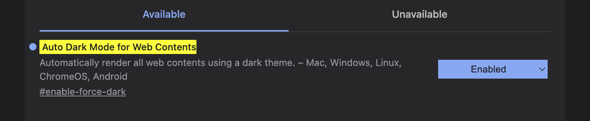

I've been using Dark Reader for chrome, but sometimes it gives me very weird result.
Searched online and people were facing the similiar issue.

Found one reddit [thread](https://www.reddit.com/r/chrome/comments/1fi98ur/looking_for_the_best_dark_mode_extension_for/) on this.

basically, we can handle it from chrome. Enabling this property can automatically activates the dark mode of website if they have support for it.

Go to the below address and enable the

```
chrome://flags/#enable-force-dark
```


