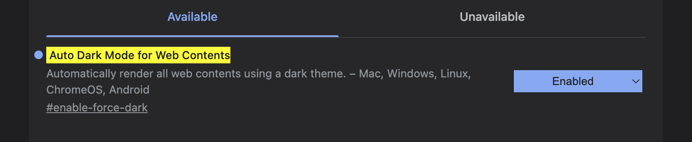

#chrome #browser #darkmode


I've been using Dark Reader for chrome, but sometimes it gives me very weird result.
Searched online and people were facing the similiar issue.

Found one reddit [thread](https://www.reddit.com/r/chrome/comments/1fi98ur/looking_for_the_best_dark_mode_extension_for/) on this.

basically, we can handle it from chrome. Enabling this property can automatically activates the dark mode of website if they have support for it.

Go to the below address and enable the flag:

```text
chrome://flags/#enable-force-dark
```



### Update: 

I find the dark mode extension simpler than this, because it sometimes display some wierd font colors, and disabling this flag require chrome restart.